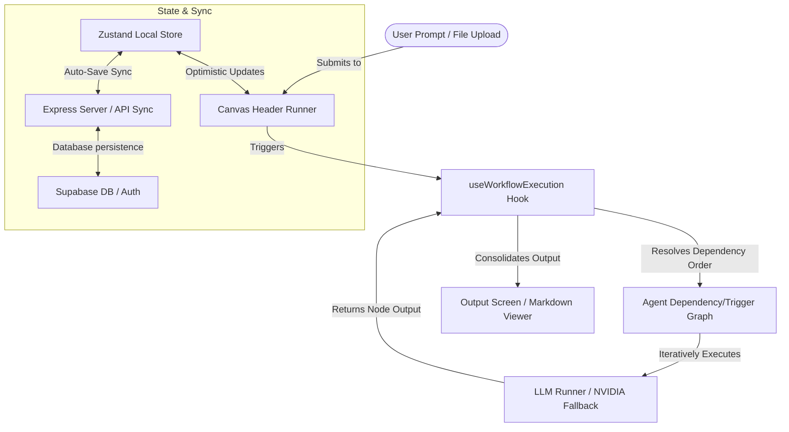

# FloatIt 🚀

FloatIt is a modern, visual **Multi-Agent AI Workflow Orchestrator** designed to help developers and AI engineers build, chain, and run multi-agent workflows on a visual interactive canvas. Users can define agents, set up triggers, pass outputs between agents, group workflows, and test execution directly on a premium React canvas interface.

---

## 🌟 Key Features

- **Interactive Node-Based Canvas**: A drag-and-drop workflow canvas supporting custom agent nodes, dynamic sizing, zoom/pan controls, connection logic, selection, and group framing.
- **Custom Agent Configuration**: Define agent roles, detailed instructions, variables, custom API keys (supporting Groq, OpenRouter, and fallbacks), trigger types, and data-flow pipes (information flow destination/source).
- **Agent Groups**: Select and group multiple agents together. Groups automatically register as tools in the main runner panel for modular workflow execution.
- **Dynamic Prompt Execution Engine**: Execute prompt pipelines using sequential/parallel agent chains, attach context files, and generate rich markdown reports.
- **Real-Time Supabase Synchronization**: Synchronizes user projects, templates, collaborations, and execution histories to Supabase in real-time, backed by clean local state management.
- **Collaborative Features**: Share projects with teammates, manage roles (Editor, Owner), and drop comments directly onto coordinates on the canvas.
- **Built-in Chatbot Panel**: Interactive sidebar helper to ask questions, control the canvas, or brainstorm agent workflows.

---

## 🛠️ Technology Stack

| Layer | Technology | Purpose |
| --- | --- | --- |
| **Frontend Core** | React 18 & TypeScript | Component-based interactive UI with TypeScript safety |
| **State Management** | Zustand 5 | Scalable local store slices for canvas, blocks, groups, comments, and sync status |
| **Styling & Icons** | Tailwind CSS & Lucide React | Modern dark-mode aesthetics, custom layouts, and vector iconography |
| **Routing** | React Router 7 | Client-side routing for Onboarding, Dashboard, Projects, and Templates |
| **Backend & Sync** | Express (Node.js) & Supabase | Real-time database persistence, remote collaboration, and authentication |
| **UI Components** | Radix UI Primitives | Accessible components for dialogs, popovers, select, and dropdowns |
| **Utility Packages** | Canvas Confetti, Date-fns, React Dropzone | Enhancing visual feedback, date processing, and smooth file uploading |

---

## 📐 Architecture & Flow



---

## 📁 Repository Structure

Below is a high-level view of the key directories and modules:

```text
src/
├── components/          # React components
│   ├── InteractiveCanvas.jsx  # Primary visual playground for node orchestration
│   ├── AgentDetailsSidebar.jsx # Sidebar to configure agent instructions, triggers, and APIs
│   ├── CanvasHeader.jsx        # Top control bar (execution runner, share controls, project title)
│   ├── CanvasComment.jsx       # Custom comment tags placed directly on the canvas
│   ├── OutputScreen.tsx        # Markdown editor & viewer showing agent output reports
│   └── ChatbotPanel.jsx        # Sidebar chatbot for workspace assistance
├── hooks/               # Custom React hooks
│   ├── useWorkflowExecution.tsx # Core agent runner logic and LLM pipeline orchestration
│   ├── engineHooks.ts           # Canvas utilities and rendering support
│   └── useAutoSave.ts           # Handles auto-saving project state to backend
├── lib/                 # Core utilities & state slices
│   ├── builderStore.ts         # High-level canvas building store
│   ├── themeStore.ts           # Application appearance controls
│   ├── stores/                 # Zustand slices (blockSlice, canvasSlice, commentSlice, groupSlice)
│   └── auth/                   # Supabase authentication context and helpers
├── pages/               # Page-level components
│   ├── Dashboard.jsx           # Entry dashboard listing recent projects and templates
│   ├── Projects.jsx            # Main workspace page mounting the canvas
│   └── Onboarding.jsx          # Login, signup, and API configuration wizard
└── types/               # TypeScript declarations
```

---

## 🚀 Getting Started

### 📋 Prerequisites

Ensure you have [Node.js](https://nodejs.org/) installed (v18 or higher is recommended) along with `npm`.

### ⚙️ Installation & Setup

1. **Clone the Repository**:
   ```bash
   git clone https://github.com/Arsh-pixel-cmd/floatit-frontend.git
   cd floatit-frontend
   ```

2. **Install Dependencies**:
   ```bash
   npm install
   ```

3. **Configure Environment Variables**:
   Copy `.env.example` to `.env` and fill in your Supabase credentials and Nvidia API keys:
   ```bash
   cp .env.example .env
   ```
   *Edit `.env` to include your Supabase URL, anon key, service key, and LLM provider credentials.*

4. **Run the Application**:
   We use `concurrently` to run both the React Vite dev server and the mock Node server simultaneously:
   ```bash
   npm run dev
   ```
   - **Frontend**: Runs locally at `http://localhost:5173`
   - **Sync Server**: Runs locally at `http://localhost:5000` (or configured port)
