# Technical Documentation — Floatit

**Author:** Arsh Mishra  
**Version:** 1.0.0  
**Last Updated:** July 2026  

---

## Table of Contents

1. [Project Overview](#1-project-overview)
2. [Core Philosophy & Design Mindset](#2-core-philosophy--design-mindset)
3. [Technology Stack](#3-technology-stack)
4. [Architecture Overview](#4-architecture-overview)
5. [Directory Structure](#5-directory-structure)
6. [Application Entry Point & Bootstrap](#6-application-entry-point--bootstrap)
7. [Routing & Navigation](#7-routing--navigation)
8. [Authentication System](#8-authentication-system)
9. [State Management](#9-state-management)
10. [The Double Diamond UX Framework](#10-the-double-diamond-ux-framework)
11. [Canvas & Builder System](#11-canvas--builder-system)
12. [Block System & Factory Pattern](#12-block-system--factory-pattern)
13. [Group Execution System](#13-group-execution-system)
14. [LLM Integration & Universal Gateway](#14-llm-integration--universal-gateway)
15. [Backend Server (Express Proxy)](#15-backend-server-express-proxy)
16. [API Key Management & Encryption](#16-api-key-management--encryption)
17. [Database Layer](#17-database-layer)
18. [HTTP Client Layer](#18-http-client-layer)
19. [Custom Hooks Reference](#19-custom-hooks-reference)
20. [Component Reference](#20-component-reference)
21. [Pages Reference](#21-pages-reference)
22. [Deployment Architecture](#22-deployment-architecture)
23. [Environment Variables](#23-environment-variables)
24. [Design Patterns Used](#24-design-patterns-used)
25. [Known Bug Tracker References](#25-known-bug-tracker-references)
26. [Developer Onboarding Checklist](#26-developer-onboarding-checklist)
27. [Future Roadmap Considerations](#27-future-roadmap-considerations)

---

## 1. Project Overview

**Floatit** is an AI-powered agentic workflow builder for UX/product teams. It allows users to visually construct multi-agent AI pipelines on an interactive canvas, where each agent node represents a specialized UX task (e.g., "Reviews Analysis", "Architecture Definition", "Usability Testing"). When executed, these agents call Large Language Models (LLMs) in sequence to produce structured, rich-HTML deliverables following the **Double Diamond** UX methodology.

### What Floatit Does

| Capability | Description |
|---|---|
| **Visual Workflow Builder** | Drag-and-drop canvas to create AI agent pipelines with blocks, connections, groups |
| **Multi-LLM Support** | Routes to OpenAI, Anthropic, Groq, Google Gemini, NVIDIA, OpenRouter, and xAI based on API key prefix |
| **Double Diamond Template** | Pre-built 4-phase UX framework: Discover → Define → Develop → Deliver |
| **Group-Based Execution** | Agents execute in batches within groups; each group produces a synthesis output |
| **Secure Key Management** | AES-256-GCM encrypted API key storage per-user and per-project |
| **Real-Time Collaboration** | Project sharing and collaborator management via Supabase |
| **Auto-Save** | Periodic background saves of canvas state to the database |
| **Canvas Annotations** | Sticky notes, text labels, freehand drawing, image embeds |

---

## 2. Core Philosophy & Design Mindset

The codebase was architected with several deliberate principles:

### 2.1 Adapter Pattern Everywhere

The #1 architectural principle: **never hard-couple to a vendor**. Every external dependency is abstracted behind an interface:

- **Auth** → `AuthAdapter` interface with `SupabaseAuthAdapter` and `LocalServerAuthAdapter` implementations
- **Database** → `DatabaseAdapter` abstract class with `SupabaseDatabaseAdapter` implementation
- **HTTP** → `IHttpClient` interface with `FetchHttpClient` implementation
- **LLM Execution** → `IExecutionStrategy` interface with `GroqStrategy` and `LocalStrategy` implementations

> **Why?** If tomorrow we need to swap Supabase for Firebase, or Groq for a self-hosted model, we change **one line** of instantiation — not 50 files of business logic.

### 2.2 SOLID Principles

| Principle | How It's Applied |
|---|---|
| **Single Responsibility (SRP)** | Each hook (`useAutoSave`, `useWorkflowExecution`, `useCanvasControls`) owns exactly one concern |
| **Open/Closed (OCP)** | `BlockRegistry` and `NodeComponentRegistry` allow adding new block types without modifying existing code |
| **Liskov Substitution (LSP)** | Any `AuthAdapter` subclass can replace `SupabaseAuthAdapter` transparently |
| **Interface Segregation (ISP)** | `IHttpClient` exposes only `get()` and `post()` — no bloated abstractions |
| **Dependency Inversion (DIP)** | Business logic depends on `DatabaseAdapter` (abstract), not on `supabase.from(...)` directly |

### 2.3 Progressive Enhancement

The app degrades gracefully:
- No Supabase credentials? → Placeholder client created, console warns, app doesn't crash
- No API key? → User is prompted; can opt into "default keys" fallback
- LLM returns invalid JSON? → Auto-recovery parses salvageable content and wraps it in styled HTML
- Database table missing? → Falls back to empty arrays with warnings

---

## 3. Technology Stack

| Layer | Technology | Purpose |
|---|---|---|
| **Frontend Framework** | React 18 (JSX/TSX) | Component UI |
| **Build Tool** | Vite 6 | Dev server, HMR, production bundling |
| **Styling** | TailwindCSS 3 | Utility-first CSS |
| **State Management** | Zustand 5 | Lightweight global stores with persist middleware |
| **Routing** | React Router DOM 7 | Client-side navigation |
| **Backend** | Express 5 (Node.js) | API proxy server for LLM calls and key management |
| **Database / Auth** | Supabase (PostgreSQL + Auth) | User auth, data persistence, real-time |
| **UI Primitives** | Radix UI | Accessible popover, select, alert dialog components |
| **Icons** | Lucide React | Consistent icon set |
| **Notifications** | react-hot-toast | Toast notifications |
| **Date Utilities** | date-fns | Date formatting |
| **Markdown Editor** | @uiw/react-md-editor | Rich text editing in outputs |
| **Confetti** | canvas-confetti | Celebration animation on workflow completion |
| **File Upload** | react-dropzone | Drag-and-drop file attachment |
| **TypeScript** | TS 5.7 | Type safety (mixed JS/TSX + TS) |
| **Linting** | ESLint 10 + typescript-eslint | Code quality |
| **Deployment** | Vercel | Hosting with serverless functions |

---

## 4. Architecture Overview

```
┌────────────────────────────────────────────────────────────────────────────┐
│                           FLOATIT ARCHITECTURE                            │
├────────────────────────────────────────────────────────────────────────────┤
│                                                                            │
│  ┌──────────────┐    ┌──────────────┐    ┌──────────────┐                 │
│  │   PAGES      │    │  COMPONENTS  │    │    HOOKS     │                 │
│  │  Onboarding  │    │ Interactive  │    │ useWorkflow  │                 │
│  │  Dashboard   │◄──►│   Canvas     │◄──►│  Execution   │                 │
│  │  Templates   │    │ AgentDetail  │    │ useAutoSave  │                 │
│  │  Projects    │    │ ProjectMenu  │    │ useCanvas    │                 │
│  │  Library     │    │ ShareModal   │    │  Controls    │                 │
│  │  Home        │    │ OutputScreen │    │ engineHooks  │                 │
│  └──────┬───────┘    └──────┬───────┘    └──────┬───────┘                 │
│         │                   │                   │                         │
│         └───────────┬───────┴───────────────────┘                         │
│                     ▼                                                      │
│  ┌────────────────────────────────────────────────────────────┐           │
│  │                    LIB (Core Logic Layer)                   │           │
│  │  ┌─────────┐ ┌──────────┐ ┌───────┐ ┌──────┐ ┌────────┐  │           │
│  │  │  auth/  │ │ blocks/  │ │ llm/  │ │http/ │ │  data/ │  │           │
│  │  │Adapter  │ │ Factory  │ │Strate │ │Proxy │ │ Schema │  │           │
│  │  │Context  │ │ Command  │ │gy Mgr │ │Client│ │Templates│  │           │
│  │  │Supabase │ │ Registry │ │Groq   │ │Fetch │ │        │  │           │
│  │  │Local    │ │ Agent    │ │Local  │ │      │ │        │  │           │
│  │  └────┬────┘ │ Webhook  │ └───┬───┘ └──┬───┘ └────────┘  │           │
│  │       │      └──────────┘     │        │                   │           │
│  │  ┌────┴─────────────────┐ ┌───┴────────┴────┐             │           │
│  │  │     STORES (Zustand) │ │   database/     │             │           │
│  │  │  workflowStore       │ │  Adapter (abs)  │             │           │
│  │  │  builderStore        │ │  Supabase impl  │             │           │
│  │  │  themeStore          │ └────────┬────────┘             │           │
│  │  │  toastStore          │          │                       │           │
│  │  └──────────────────────┘          │                       │           │
│  └────────────────────────────────────┼───────────────────────┘           │
│                                       ▼                                    │
│  ┌────────────────────────────────────────────────────────────┐           │
│  │                EXPRESS BACKEND (server.js)                  │           │
│  │  • API key encryption/decryption (AES-256-GCM)             │           │
│  │  • Universal LLM Gateway (auto-detects provider by key)    │           │
│  │  • JWT authentication middleware                            │           │
│  │  • Retry with exponential backoff + fallback keys           │           │
│  │  • Streaming SSE endpoint for agent thinking logs           │           │
│  └────────────────────────────────────┬───────────────────────┘           │
│                                       ▼                                    │
│  ┌────────────────────────────────────────────────────────────┐           │
│  │              EXTERNAL SERVICES                              │           │
│  │  Supabase (Auth + DB)  │  LLM Providers (7+)  │  Vercel   │           │
│  └────────────────────────────────────────────────────────────┘           │
└────────────────────────────────────────────────────────────────────────────┘
```

### Data Flow (Simplified)

```mermaid
flowchart LR
    A["User Input<br/>(Project Prompt)"] --> B["useWorkflowExecution"]
    B --> C["ExecutionStrategyManager"]
    C --> D["callLLM (Frontend Client)"]
    D --> E["apiProxy.post<br/>(AuthenticatedApiProxy)"]
    E --> F["Express Server<br/>/api/llm"]
    F --> G["resolveApiKey<br/>(Decrypt from Supabase)"]
    G --> H["determineProvider<br/>(Key Prefix Detection)"]
    H --> I["LLM Provider API<br/>(OpenAI/Groq/Gemini/etc.)"]
    I --> J["JSON Response<br/>{content, ui}"]
    J --> K["Parse & Sanitize"]
    K --> L["Zustand Store Update<br/>(nodeResults)"]
    L --> M["Canvas Re-render<br/>(Output UI)"]
```

---

## 5. Directory Structure

```
floatit-frontend/
├── api/
│   └── index.js                    # Vercel Serverless Function entry (re-exports server.js)
├── public/
│   ├── Floatit.png                 # Branding image
│   ├── favicon.svg                 # Browser favicon
│   ├── logo.png                    # App logo
│   └── _redirects                  # Netlify-style SPA redirect fallback
├── src/
│   ├── App.jsx                     # Root component — page router (manual, not react-router)
│   ├── main.jsx                    # React DOM entry — providers, theme init
│   ├── index.css                   # Tailwind imports
│   │
│   ├── components/                 # Reusable UI components
│   │   ├── InteractiveCanvas.jsx   # [CORE] The main canvas — blocks, connections, tools
│   │   ├── AgentDetailsSidebar.jsx # Right panel — agent config, results viewer
│   │   ├── CanvasHeader.jsx        # Top bar — prompt input, run controls
│   │   ├── CanvasSidebar.jsx       # Left panel — group list, navigation
│   │   ├── CanvasComment.jsx       # Canvas comment pins (Figma-style)
│   │   ├── ChatbotPanel.jsx        # AI chatbot assistant panel
│   │   ├── ConfirmDialog.jsx       # Radix-based confirmation modal
│   │   ├── OutputScreen.tsx        # Full-screen workflow output viewer
│   │   ├── ProjectMenu.jsx         # Kebab menu for project actions
│   │   ├── ShareModal.tsx          # Collaboration sharing dialog
│   │   └── Sidebar.jsx             # App-level sidebar (navigation)
│   │
│   ├── pages/                      # Top-level page components
│   │   ├── Onboarding.jsx          # Auth flow — signup, login, API key setup
│   │   ├── Dashboard.jsx           # Project grid/list with folders
│   │   ├── Templates.jsx           # Template gallery
│   │   ├── Projects.jsx            # Project management view
│   │   ├── Library.tsx             # Saved templates library
│   │   └── Home.jsx                # Landing/home page
│   │
│   ├── hooks/                      # Custom React hooks
│   │   ├── useWorkflowExecution.tsx # [CORE] Pipeline orchestration logic
│   │   ├── useAutoSave.ts          # Periodic canvas state sync
│   │   ├── useProjectCollaborators.ts # Collaborator data fetching
│   │   └── engineHooks.ts          # Canvas interaction hooks bundle
│   │
│   ├── lib/                        # Core business logic modules
│   │   ├── auth/                   # Authentication adapter system
│   │   │   ├── AuthAdapter.ts      # Interface contract (abstract base)
│   │   │   ├── AuthContext.tsx      # React Context + Provider + useAuth hook
│   │   │   ├── SupabaseAuthAdapter.ts # Supabase implementation
│   │   │   ├── LocalServerAuthAdapter.ts # REST API implementation (migration-ready)
│   │   │   └── index.ts            # Public API exports
│   │   │
│   │   ├── blocks/                 # Block creation & management
│   │   │   ├── BlockFactory.ts     # IBlockFactory interface + BlockRegistry
│   │   │   ├── AgentBlockFactory.ts # Creates agent-type blocks
│   │   │   ├── WebhookBlockFactory.ts # Creates webhook-type blocks
│   │   │   ├── CommandHistory.ts   # Undo/Redo stack (Command Pattern)
│   │   │   ├── ICommand.ts         # Command interface {execute, undo}
│   │   │   ├── NodeComponentRegistry.tsx # Maps block types → React components
│   │   │   └── index.ts            # Auto-registers factories on import
│   │   │
│   │   ├── canvas/                 # Canvas element utilities
│   │   │   └── CanvasElementFactory.ts # Factory for sticky notes, text labels, images
│   │   │
│   │   ├── database/               # Database adapter system
│   │   │   ├── DatabaseAdapter.ts  # Abstract base class + domain types
│   │   │   ├── SupabaseDatabaseAdapter.ts # Supabase implementation
│   │   │   └── index.ts            # Instantiates + exports default adapter
│   │   │
│   │   ├── http/                   # HTTP client abstraction
│   │   │   ├── IHttpClient.ts      # Interface: {get, post}
│   │   │   ├── FetchHttpClient.ts  # Fetch-based implementation
│   │   │   └── AuthenticatedApiProxy.ts # Decorator — auto-injects Bearer token
│   │   │
│   │   ├── llm/                    # LLM execution strategies
│   │   │   ├── IExecutionStrategy.ts # Strategy interface
│   │   │   ├── ExecutionStrategyManager.ts # Strategy registry
│   │   │   ├── GroqStrategy.ts     # Groq-specific execution
│   │   │   └── LocalStrategy.ts    # Default NVIDIA/local execution
│   │   │
│   │   ├── stores/                 # Zustand store slices (modular)
│   │   │   ├── blockSlice.ts       # Block CRUD, connections, selection
│   │   │   ├── canvasSlice.ts      # View mode, sticky notes, draw lines, images
│   │   │   ├── groupSlice.ts       # Group CRUD, execution tracking
│   │   │   ├── serverSyncSlice.ts  # Template deployment, server save/load
│   │   │   └── commentSlice.ts     # Comment pins with replies
│   │   │
│   │   ├── store.ts                # WorkflowStore — execution state, animation, phases
│   │   ├── builderStore.ts         # BuilderStore — composer of all slices, persisted
│   │   ├── themeStore.ts           # Theme management (light/dark/system)
│   │   ├── toastStore.ts           # Toast notification queue
│   │   ├── llm.ts                  # Frontend LLM client (callLLM function)
│   │   ├── supabaseClient.ts       # Supabase client initialization
│   │   └── routes.ts               # Route path constants
│   │
│   ├── data/                       # Static data & schemas
│   │   ├── schema.ts               # Tool registry, UX categories, phases, edges
│   │   ├── initialTemplateAgents.js # Landing page agent visualization data
│   │   └── templates/
│   │       └── doubleDiamond.ts    # Double Diamond template builder
│   │
│   └── types/                      # TypeScript type definitions
│       ├── engine.ts               # Block, Camera, StickyNote, GraphStatus types
│       ├── commentTypes.ts         # CanvasComment, CommentReply
│       └── groupTypes.ts           # Group type definition
│
├── server.js                       # Express backend server (784 lines)
├── vercel.json                     # Vercel deployment config + rewrites
├── vite.config.js                  # Vite build configuration
├── tailwind.config.js              # TailwindCSS config
├── package.json                    # Dependencies and scripts
├── .env.example                    # Environment variable template
└── .gitignore                      # Git ignore rules
```

---

## 6. Application Entry Point & Bootstrap

### Boot Sequence

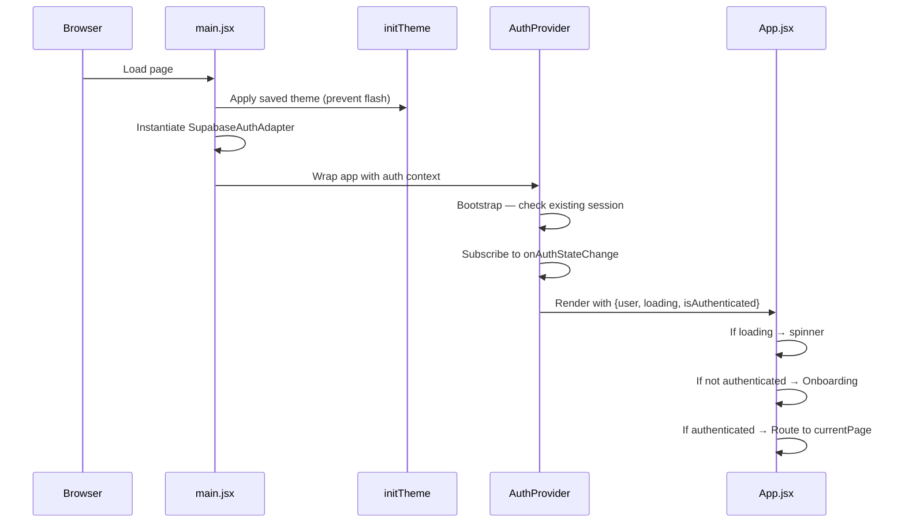

### `main.jsx` — What Happens on Load

```javascript
// 1. Apply saved theme immediately (before React renders)
initTheme();

// 2. Create auth adapter instance
const authAdapter = new SupabaseAuthAdapter();

// 3. Render React tree
ReactDOM.createRoot(document.getElementById('root')).render(
  <React.StrictMode>
    <BrowserRouter>
      <AuthProvider adapter={authAdapter}>
        <App />
        <Toaster position="bottom-right" toastOptions={{ duration: 2000 }} />
      </AuthProvider>
    </BrowserRouter>
  </React.StrictMode>
);
```

> **Key Insight:** The `AuthProvider` receives an adapter instance via props. This is the injection point — change the adapter to switch auth backends.

### `App.jsx` — Manual Page Router

The app uses a **manual routing system** (not React Router's `<Routes>`) via `currentPage` state persisted in `localStorage`:

```javascript
const [currentPage, setCurrentPage] = useState(() => {
  return localStorage.getItem('currentPage') || 'templates';
});
```

| `currentPage` Value | Component Rendered |
|---|---|
| `'templates'` | `<Templates />` |
| `'dashboard'` | `<Dashboard />` |
| `'templateCanvas'` | `<InteractiveCanvas mode="template" />` |
| `'newProject'` | `<InteractiveCanvas mode="new" />` |
| `'projects'` | `<Projects />` |
| `'library'` | `<Library />` |
| *(default)* | `<Home />` |
| *(not authenticated)* | `<Onboarding />` |

> **Design Decision:** This manual routing was chosen because the canvas view needs to be rendered without URL changes (SPA-in-SPA pattern). The `InteractiveCanvas` component is essentially a full-screen app within the app.

---

## 7. Routing & Navigation

### Route Constants

Defined in `src/lib/routes.ts`:

```typescript
export const ROUTES = {
  landing: '/',
  dashboard: '/dashboard',
  canvas: '/canvas',
  profile: '/profile',
} as const;
```

These are used by the `ProtectedRoute` component for redirect logic when authentication fails.

### Navigation Flow

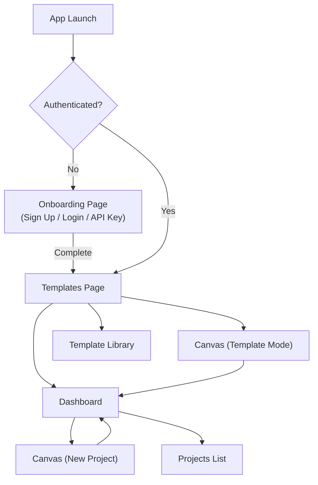

---

## 8. Authentication System

### Architecture

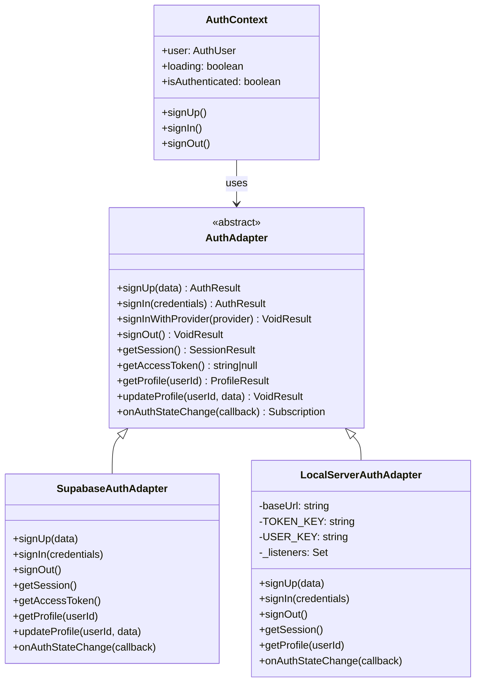

### Standard User Shape (`AuthUser`)

```typescript
interface AuthUser {
  id: string;
  email: string;
  name: string;
  company: string | null;
  avatarUrl: string | null;
  createdAt: string | null;
}
```

### How to Switch Auth Backends

Change **one line** in `main.jsx`:

```javascript
// FROM: Supabase
const authAdapter = new SupabaseAuthAdapter();

// TO: Local REST API server
import { LocalServerAuthAdapter } from './lib/auth';
const authAdapter = new LocalServerAuthAdapter('http://localhost:3001');
```

Everything else (components, hooks, stores) works unchanged because they only depend on the `useAuth()` hook which returns the same interface regardless of adapter.

### Sign Out Cleanup

When a user signs out, the `AuthContext` performs critical cleanup:

```javascript
// Clear store canvas state to prevent data leak to other users
useBuilderStore.getState().resetCanvas();
localStorage.removeItem('active_sequence_id');
localStorage.removeItem('use_default_key');
localStorage.removeItem('agentic_model');
localStorage.removeItem('currentPage');
```

---

## 9. State Management

### Store Architecture

Floatit uses **3 independent Zustand stores** plus 2 utility stores:

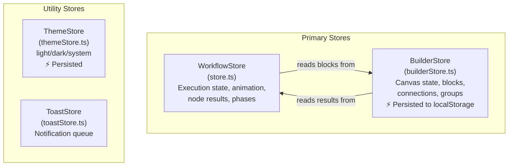

### WorkflowStore (`store.ts`)

The **execution engine state**. Not persisted — resets on page reload.

| State | Type | Purpose |
|---|---|---|
| `graphStatus` | `'idle' \| 'loading' \| 'ready' \| 'running' \| 'completed' \| 'error'` | Overall pipeline state |
| `projectPrompt` | `string` | Master user input for the entire workflow |
| `flowTitle` | `string` | Display name for the current workflow |
| `projectAttachment` | `{name, content, type} \| null` | Uploaded file context |
| `currentPhaseIndex` | `number` | Active phase in sequential execution |
| `nodeStates` | `Record<nodeId, 'idle' \| 'running' \| 'completed' \| 'stuck_debugger'>` | Per-node execution status |
| `nodeResults` | `Record<nodeId, {content, ui, agentName}>` | Per-node LLM output |
| `nodeStatusTexts` | `Record<nodeId, string>` | Human-readable status messages |
| `revealedPhases` | `string[]` | Progressive phase animation tracking |
| `selectedNodeId` | `string \| null` | Currently focused node |
| `selectedGroupId` | `string \| null` | Currently focused group (for prompt bar) |
| `editedOutputs` | `Record<groupId, string>` | User-edited synthesis outputs |
| `activeMode` | `'explorer' \| 'advisor'` | UI mode toggle |
| `layoutMode` | `'desktop' \| 'tablet' \| 'mobile'` | Responsive layout |
| `userContext` | `{role, budget, weights}` | Scoring weights for tool intelligence |

### BuilderStore (`builderStore.ts`)

The **canvas persistence store**. Composed from 5 modular slices and persisted to `localStorage` under the key `floatit-builder-storage`.

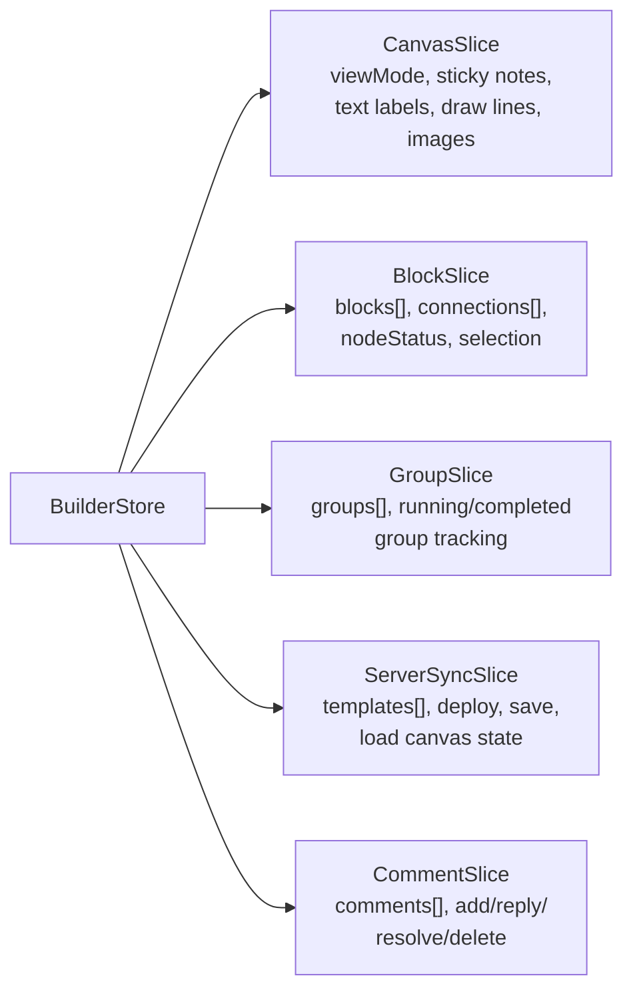

### What Gets Persisted

Only serializable canvas state is persisted:

```typescript
partialize: (state) => ({
  blocks: state.blocks,
  connections: state.connections,
  stickyNotes: state.stickyNotes,
  textLabels: state.textLabels,
  drawLines: state.drawLines,
  groups: state.groups,
  viewMode: state.viewMode,
  deployedTemplateId: state.deployedTemplateId,
  comments: state.comments,
}),
```

> **Note:** `selectedBlockIds` is intentionally stored as `string[]` (not `Set`) for JSON serialization compatibility (BUG-017).

---

## 10. The Double Diamond UX Framework

### What is the Double Diamond?

The Double Diamond is a design thinking framework with 4 phases that alternate between divergent (exploring) and convergent (focusing) thinking:

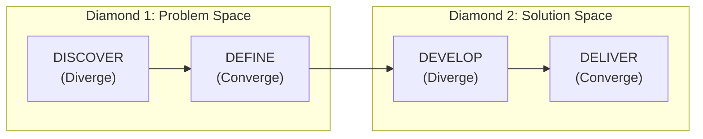

### Phase Structure in Code

Defined in `src/data/schema.ts`:

| Phase | Type | Categories (Agent Nodes) | Agent Count |
|---|---|---|---|
| **DISCOVER** | Diverge | Reviews, Observations, Primary Research, Secondary Research, Tech & Channels | 5 |
| **DEFINE** | Converge | UX Flow Mapping, Persuasion Tools, Architecture | 3 |
| **DEVELOP** | Diverge | Screens, Images & Texts, Interactions, Navigations | 4 |
| **DELIVER** | Converge | Expert Review, Usability Test, Brand Test, UX Test | 4 |

### Tool Registry

Each UX category has associated AI tools with metadata for intelligent recommendation:

```typescript
// Example tool entry
"perplexity": {
  id: "perplexity",
  name: "Perplexity",
  description: "Market research, competitive research, refined web search.",
  pricing: "freemium",       // free | freemium | paid
  audience: ["researcher", "strategist", "designer"],
  tags: ["search", "market analysis"]
}
```

### Edge Graph

The `EDGES` array defines data flow between nodes:

```
DISCOVER                    DEFINE                  DEVELOP                DELIVER
Reviews ──────────────► UX Flow ─────────────► Navigations ──────────► UX Test
Observations ─────────► UX Flow                Screens ──────────────► Usability Test
Primary Research ──────► UX Flow + Persuasion   Images & Texts ───────► Brand Test
Secondary Research ────► Architecture           Interactions ─────────► Usability Test
Tech & Channels ──────► Architecture            Screens ──────────────► Expert Review
                        Architecture ──────────► Screens + Interactions
                        Persuasion ────────────► Images & Texts
```

### Pre-Built Double Diamond Template

`src/data/templates/doubleDiamond.ts` provides `buildDoubleDiamondBlocks()` and `buildDoubleDiamondConnections()` which generate a complete 20-block, 26-connection workflow with:

- 5 Discover agents + 1 Discover Output synthesis node
- 3 Define agents + 1 Define Output synthesis node
- 4 Develop agents + 1 Develop Output synthesis node
- 4 Deliver agents + 1 Deliver Output synthesis node

Each agent has a pre-defined `description` that becomes its LLM prompt context.

---

## 11. Canvas & Builder System

### Interactive Canvas (`InteractiveCanvas.jsx`)

This is the **heart of the application** — a 36KB React component that provides:

| Feature | Description |
|---|---|
| **Infinite Canvas** | Pan/zoom with mouse wheel (scroll = pan, Ctrl+scroll = zoom) |
| **Block Rendering** | Agent and Webhook blocks rendered at world-space coordinates |
| **Connection Drawing** | Bezier curves between block ports (output → input) |
| **Tool Palette** | Cursor, Sticky Note, Text Label, Highlighter, Connect tools |
| **Drag & Drop** | Blocks can be repositioned on the canvas |
| **Multi-Selection** | Shift+click to select multiple blocks for grouping |
| **Canvas Annotations** | Sticky notes, text labels, freehand drawing, images |
| **Canvas Locking** | Lock the canvas to prevent accidental edits |
| **Comment Pins** | Figma-style comment threads pinned to canvas coordinates |
| **Zoom Controls** | Keyboard shortcuts and UI buttons for zoom/pan |
| **Focus Mode** | Camera auto-navigates to selected block |

### Canvas Coordinate System

The canvas uses a **world-space coordinate system** with a camera transform:

```
Screen Position = (World Position × Zoom) + Camera Offset
World Position  = (Screen Position - Camera Offset) / Zoom
```

```typescript
const getCanvasCoords = (clientX: number, clientY: number) => ({
  x: (clientX - camera.x) / camera.zoom,
  y: (clientY - camera.y) / camera.zoom,
});
```

### View Modes

| Mode | Description |
|---|---|
| `'builder'` | Full editing mode — add/edit/delete blocks, draw connections |
| `'presentation'` | Read-only view for presenting workflow results |

---

## 12. Block System & Factory Pattern

### Block Type Hierarchy

```mermaid
classDiagram
    class BaseBlock {
        +id: string
        +name: string
        +description: string
        +position: {x, y}
        +size?: {width, height}
        +waitConfig: {type, delay}
        +triggerConfig: {type}
        +isGroupOutput?: boolean
    }

    class AgentBlock {
        +type: 'agent'
        +apiKey: string
        +useCustomKey?: boolean
        +phase?: string
        +outputContext?: string
    }

    class WebhookBlock {
        +type: 'webhook'
        +linkedSequenceId: string|null
        +linkedSequenceName: string
    }

    BaseBlock <|-- AgentBlock
    BaseBlock <|-- WebhookBlock
```

### Factory Pattern

Block creation is centralized through the **Factory Method** + **Registry** pattern:

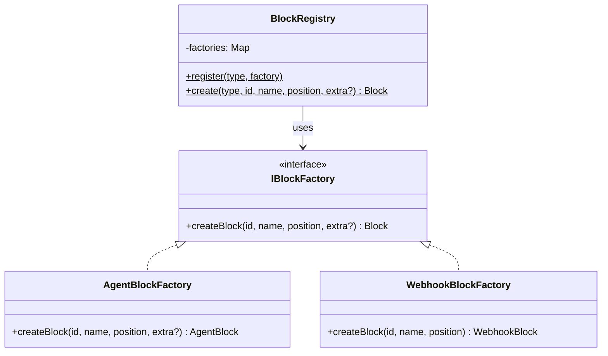

### How to Add a New Block Type

1. **Create a new factory** in `src/lib/blocks/`:

```typescript
// TriggerBlockFactory.ts
import type { IBlockFactory } from './BlockFactory';

export class TriggerBlockFactory implements IBlockFactory {
  createBlock(id, name, position, extra?) {
    return {
      id, type: 'trigger', name,
      description: 'Event-based trigger...',
      position,
      waitConfig: { type: 'none', delay: 0 },
      triggerConfig: { type: 'event' },
    };
  }
}
```

2. **Register it** in `src/lib/blocks/index.ts`:

```typescript
import { TriggerBlockFactory } from './TriggerBlockFactory';
BlockRegistry.register('trigger', new TriggerBlockFactory());
```

3. **Add the type** to `src/types/engine.ts`:

```typescript
export interface TriggerBlock extends BaseBlock {
  type: 'trigger';
  eventType: string;
}
export type Block = AgentBlock | WebhookBlock | TriggerBlock;
```

### Command History (Undo/Redo)

```typescript
interface ICommand {
  execute(): void;
  undo(): void;
}

class CommandHistory {
  static execute(command: ICommand)  // Push to undo stack, clear redo
  static undo()                       // Pop from undo, push to redo
  static redo()                       // Pop from redo, push to undo
  static clear()                      // Reset both stacks
}
```

> **Note:** The Command pattern infrastructure is in place but not yet fully integrated into all canvas operations. This is a foundation for future undo/redo support.

---

## 13. Group Execution System

### What Are Groups?

Groups are the **execution units** in Floatit. A group is a collection of agent blocks that execute together, producing a synthesis output:

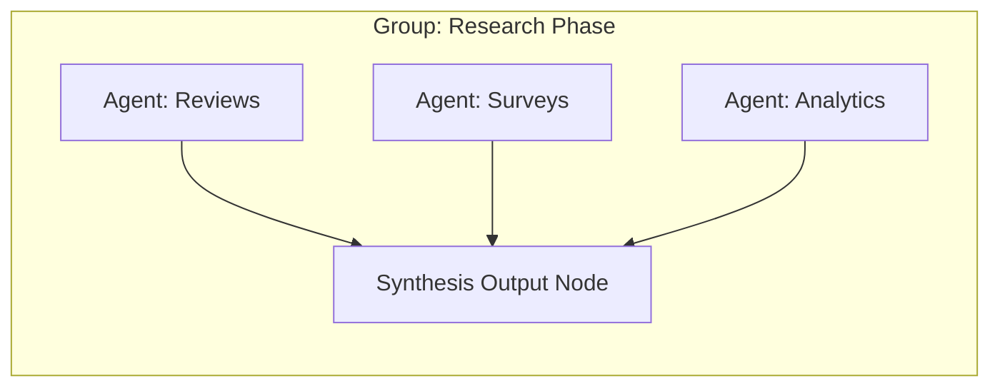

### Group Data Structure

```typescript
interface Group {
  id: string;
  name: string;
  blockIds: string[];       // Agent block IDs in this group
  outputBlockId: string;    // Auto-created synthesis output node
  order: number;            // Workflow execution sequence
}
```

### Group Creation Flow

1. User selects multiple blocks on canvas (Shift+Click)
2. User clicks "Create Group" button
3. `createGroup()` in `groupSlice.ts`:
   - Finds the rightmost selected block
   - Creates an output synthesis node positioned to the right
   - Creates connections from each selected block → output node
   - Creates the Group record with an `order` based on existing groups

### Execution Flow

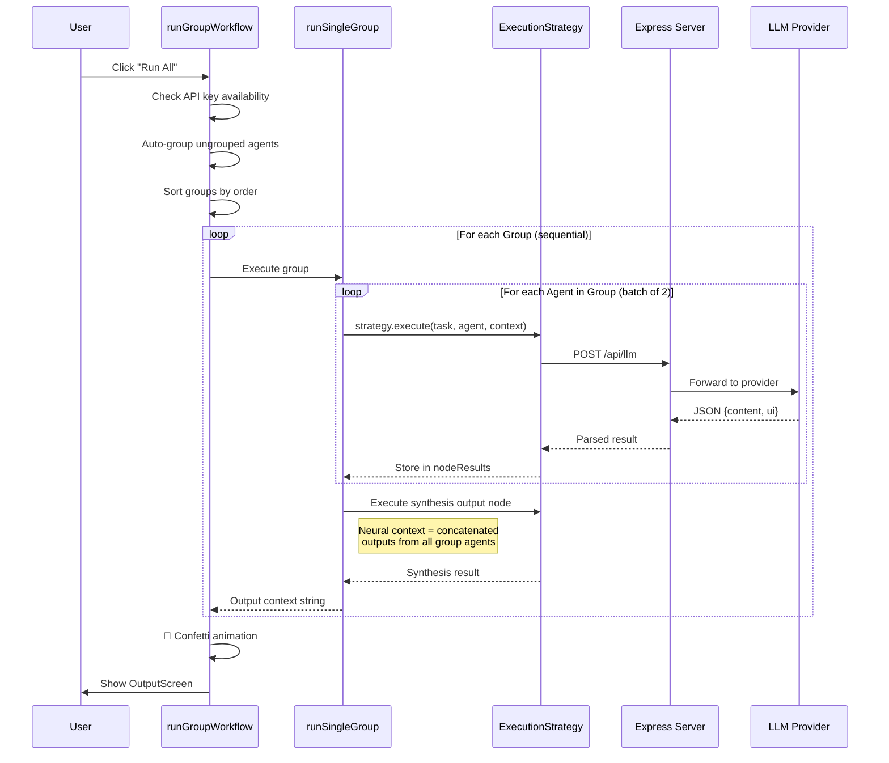

### Concurrency Control

- **Batch size:** 2 agents execute concurrently within a group
- **Inter-batch delay:** 1.5s stagger between agents in the same batch
- **Inter-group:** Sequential (Group N's output becomes Group N+1's context)
- **Timeout:** 180s client-side safety net per agent call
- **Retry:** Auto-retry loop for `stuck_debugger` state (waits for user or auto-retry)

### Stop Execution

When the user clicks "Stop":

1. All active `AbortController`s are aborted
2. `graphStatus` is set to `'ready'`
3. All `'running'` nodes are reset to `'idle'`
4. `runningGroupId` is cleared

---

## 14. LLM Integration & Universal Gateway

### Frontend Client (`src/lib/llm.ts`)

The `callLLM()` function is the frontend's single point of contact for LLM execution:

```typescript
async function callLLM(
  userTask: string,       // The prompt
  agent: object,          // Agent metadata (name, phase, etc.)
  neuralContext: string,  // Previous phase outputs
  attachment: object,     // Uploaded file content
  useDefaultKey: boolean, // Whether to use server-side fallback key
  requestedModel?: string,// Specific model to use
  signal?: AbortSignal    // Cancellation signal
): Promise<{content: string, ui: string}>
```

### Retry Logic (Frontend)

```
Attempt 1: Normal call
  ↓ 429/503/502?
Attempt 2: Wait 2s → retry
  ↓ Still failing?
Attempt 3: Wait 4s → retry
  ↓ Still failing?
Return error to UI
```

### Execution Strategy Pattern

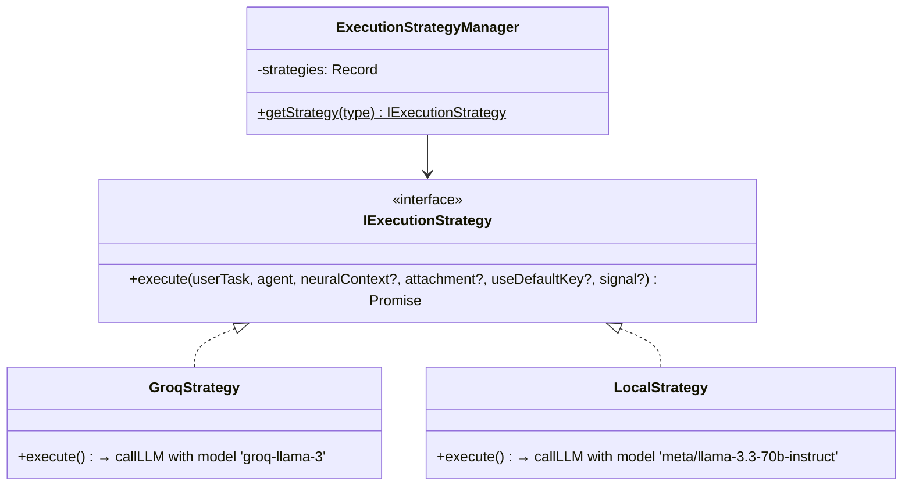

### How to Add a New LLM Strategy

1. Create `src/lib/llm/OpenAIStrategy.ts`:

```typescript
import { IExecutionStrategy } from './IExecutionStrategy';
import { callLLM } from '../llm';

export class OpenAIStrategy implements IExecutionStrategy {
  async execute(userTask, agent, neuralContext = '', attachment = null, useDefaultKey = false, signal?) {
    return callLLM(userTask, agent, neuralContext, attachment, useDefaultKey, 'gpt-4o', signal);
  }
}
```

2. Register in `ExecutionStrategyManager.ts`:

```typescript
import { OpenAIStrategy } from './OpenAIStrategy';
// ...
private static strategies = {
  groq: new GroqStrategy(),
  local: new LocalStrategy(),
  openai: new OpenAIStrategy(),  // ← Add this
};
```

---

## 15. Backend Server (Express Proxy)

### Why a Backend Server?

**Security.** API keys must never be sent to the browser. The Express server:

1. Stores encrypted API keys in Supabase
2. Decrypts them server-side when an LLM call is needed
3. Proxies the request to the LLM provider
4. Returns only the result to the frontend

### Server Architecture

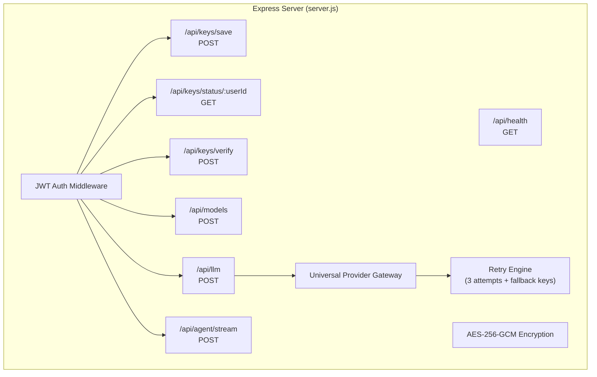

### API Endpoints Reference

| Method | Endpoint | Auth | Description |
|---|---|---|---|
| `GET` | `/api/health` | ❌ | Health check |
| `POST` | `/api/keys/save` | ✅ | Encrypt and store API key globally |
| `GET` | `/api/keys/status/:userId` | ✅ | Check if key exists (never returns key) |
| `GET` | `/api/keys/project-status/:userId/:sequenceId` | ✅ | Check project-scoped key |
| `POST` | `/api/keys/save-project` | ✅ | Save project-scoped key |
| `DELETE` | `/api/keys/:userId` | ✅ | Delete global key |
| `DELETE` | `/api/keys/project/:userId/:sequenceId` | ✅ | Delete project key |
| `POST` | `/api/keys/verify` | ✅ | Test key validity with ping call |
| `POST` | `/api/models` | ✅ | Fetch available models for a key |
| `POST` | `/api/llm` | ✅ | Execute LLM call (main endpoint) |
| `POST` | `/api/agent/stream` | ✅ | SSE streaming for agent thinking logs |

### Universal Provider Gateway

The server auto-detects the LLM provider by **API key prefix**:

| Key Prefix | Provider | Default Model | API URL |
|---|---|---|---|
| `sk-or-` | OpenRouter | `openrouter/auto` | `openrouter.ai/api/v1/chat/completions` |
| `sk-ant-` | Anthropic | `claude-3-5-sonnet-20240620` | `api.anthropic.com/v1/messages` |
| `gsk_` | Groq | `llama-3.3-70b-versatile` | `api.groq.com/openai/v1/chat/completions` |
| `xai-` | xAI | `grok-beta` | `api.x.ai/v1/chat/completions` |
| `AIzaSy` | Google Gemini | `gemini-2.0-flash` | `generativelanguage.googleapis.com/...` |
| `nvapi-` | NVIDIA | `meta/llama-3.3-70b-instruct` | `integrate.api.nvidia.com/v1/chat/completions` |
| `sk-` | OpenAI | `gpt-4o` | `api.openai.com/v1/chat/completions` |
| *(fallback)* | OpenRouter | `openrouter/auto` | `openrouter.ai/api/v1/chat/completions` |

### LLM Prompt Engineering

The server constructs a system prompt based on the **phase** of the agent:

| Phase Contains | Directive |
|---|---|
| DISCOVER / RESEARCH | Market sentiment analysis, competitor mapping, user persona profiling |
| DEFINE / ARCHITECTURE | System architecture, data flow diagrams (Mermaid), technical specs |
| DEVELOP / BUILD | Production-ready code, React components, complex logic handlers |
| DELIVER / DEPLOY | Deployment manifest, CI/CD pipeline, final project summary |

The response format is enforced as JSON:

```json
{
  "content": "Text output with analysis...",
  "ui": "Self-contained HTML with inline styles using Midnight Luxe Design System"
}
```

### Server Retry Strategy

```
Attempt 1: Primary key + requested model (90s timeout)
Attempt 2: Primary key + lighter fallback model (45s timeout)
Attempt 3+: FALLBACK_KEYS (if configured, shuffled for load distribution)
```

### JSON Auto-Recovery

If the LLM returns invalid JSON:

1. Extract content between first `{` and last `}`
2. Strip control characters
3. Attempt JSON.parse
4. If still fails → regex-extract `content` field → wrap in styled HTML with "Auto-Recovered Mode" badge

---

## 16. API Key Management & Encryption

### Encryption Algorithm

```
Algorithm:   AES-256-GCM
Key Derivation: scrypt(ENCRYPTION_SECRET, random_salt, 32 bytes)
IV:          16 random bytes
Output:      {encrypted: "salt:ciphertext", iv: hex, authTag: hex}
```

### Key Resolution Priority

When the server needs an API key for an LLM call:

```
1. Project-scoped encrypted key (user_keys table where project_id = sequenceId)
   ↓ Not found?
2. Global encrypted key (user_keys table where project_id = 'global')
   ↓ Not found?
3. Fallback key from client request body (if provided)
   ↓ Not found?
4. Server-side DEFAULT_NVIDIA_KEY (if useDefaultKey=true)
   ↓ Not found?
5. Return 401 with _errorType: 'NO_KEY'
```

### Supabase `user_keys` Table Schema

| Column | Type | Description |
|---|---|---|
| `user_id` | UUID | FK to auth.users |
| `project_id` | TEXT | `'global'` or sequence UUID |
| `encrypted` | TEXT | `"salt:ciphertext"` |
| `iv` | TEXT | Initialization vector (hex) |
| `auth_tag` | TEXT | Authentication tag (hex) |
| `last_four` | TEXT | Last 4 chars of key (for display) |
| `saved_at` | TIMESTAMPTZ | When the key was stored |

> **Security:** The actual API key is never stored in plaintext, never sent back to the client, and the `ENCRYPTION_SECRET` should be a 32+ byte random string unique per deployment.

---

## 17. Database Layer

### Architecture

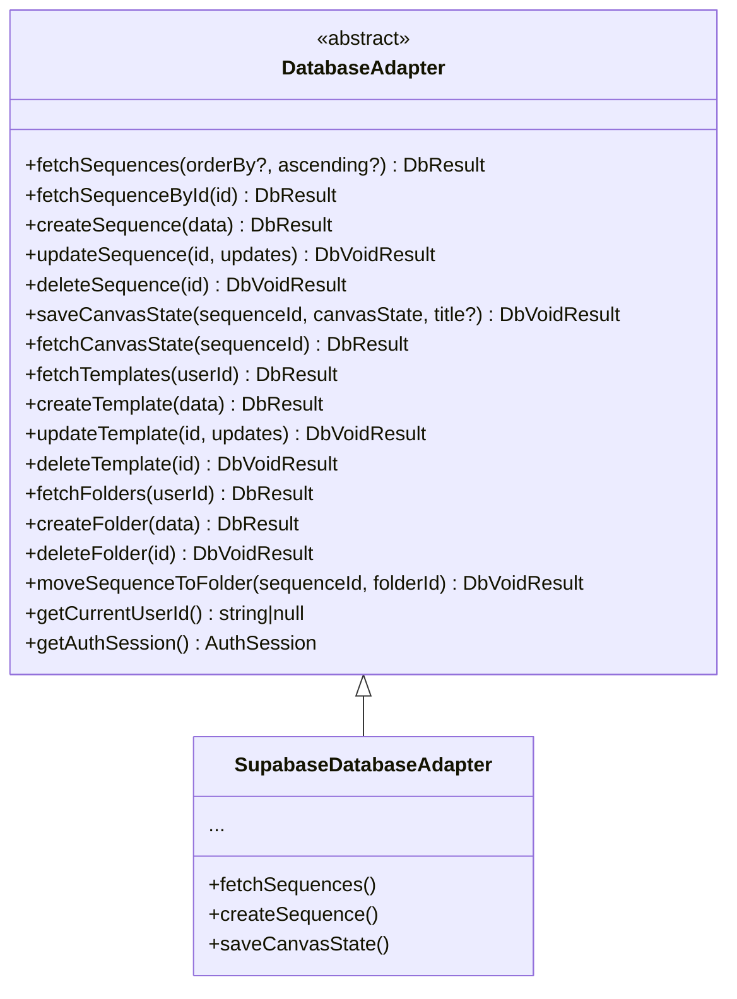

### Supabase Tables

| Table | Purpose |
|---|---|
| `sequences` | Projects/workflows — canvas_state (JSONB), title, status |
| `templates` | Saved reusable workflow templates |
| `user_keys` | Encrypted API keys (per user, per project) |
| `profiles` | Extended user profile data |
| `folders` | Project organization folders |
| `project_collaborators` | Sharing/collaboration records |

### Canvas State Payload

The entire canvas is serialized as a JSONB column in the `sequences` table:

```typescript
interface CanvasStatePayload {
  blocks: Block[];
  connections: Connection[];
  stickyNotes: StickyNote[];
  textLabels: TextLabel[];
  groups: Group[];
  deployedTemplateId?: string | null;
  execution?: {
    nodeStates: Record<string, any>;
    nodeResults: Record<string, any>;
    currentPhaseIndex: number;
    projectPrompt: string;
  };
}
```

### How to Switch Database Backends

Change one line in `src/lib/database/index.ts`:

```typescript
// FROM: Supabase
export const dbAdapter: DatabaseAdapter = new SupabaseDatabaseAdapter();

// TO: Your custom adapter
export const dbAdapter: DatabaseAdapter = new MyDatabaseAdapter();
```

---

## 18. HTTP Client Layer

### Architecture

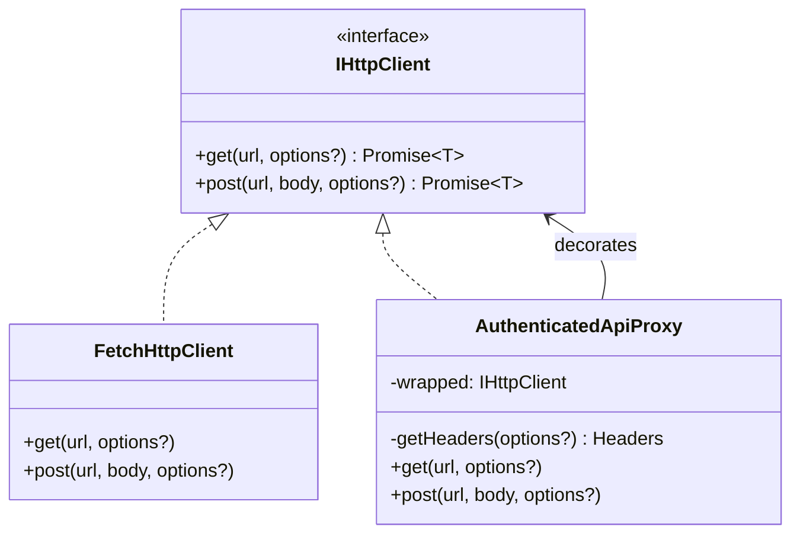

The `AuthenticatedApiProxy` is a **Decorator** that wraps any `IHttpClient` and automatically injects the Supabase JWT Bearer token into every request:

```typescript
const apiProxy = new AuthenticatedApiProxy(httpClient);
// Usage:
const data = await apiProxy.post('/api/llm', { userTask, agent, ... });
// → Automatically adds: Authorization: Bearer <supabase_jwt>
```

---

## 19. Custom Hooks Reference

| Hook | File | Purpose |
|---|---|---|
| `useWorkflowExecution` | `hooks/useWorkflowExecution.tsx` | Pipeline orchestration — `runGroupWorkflow()`, `runSingleGroup()`, `stopExecution()` |
| `useAutoSave` | `hooks/useAutoSave.ts` | 5-second interval auto-save with hash-based change detection |
| `useProjectCollaborators` | `hooks/useProjectCollaborators.ts` | Fetch, invite, and manage project collaborators from Supabase |
| `usePromptInput` | `hooks/engineHooks.ts` | Manages project prompt, attachment, and file input ref |
| `useModalState` | `hooks/engineHooks.ts` | API key modal, token limit modal, output screen state |
| `usePhaseOverlay` | `hooks/engineHooks.ts` | Phase transition overlay between group executions |
| `useCanvasControls` | `hooks/engineHooks.ts` | Camera state, panning, zooming, tool management, drawing, sticky notes |

### `useAutoSave` — How It Works

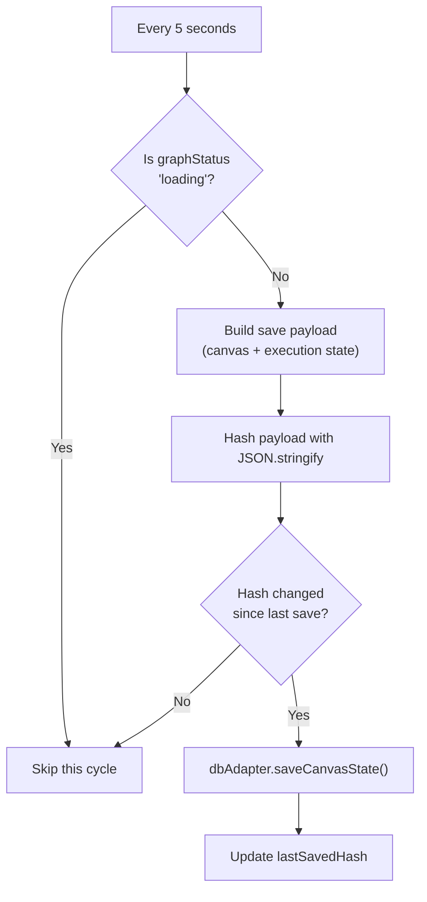

### `useWorkflowExecution` — Key Behaviors

- **Auto-grouping:** If the user clicks "Run" with ungrouped blocks, they're automatically grouped into "Phase 1"
- **Neural Bridge:** Each group's synthesis output becomes the `neuralContext` for the next group
- **Stuck Debugger:** If an LLM call returns `_errorType`, the node enters `'stuck_debugger'` state and waits for manual retry
- **Confetti:** On workflow completion, celebratory confetti fires from both screen edges

---

## 20. Component Reference

| Component | File | Size | Description |
|---|---|---|---|
| `InteractiveCanvas` | `InteractiveCanvas.jsx` | 36KB | Core canvas — blocks, connections, tools, annotations |
| `AgentDetailsSidebar` | `AgentDetailsSidebar.jsx` | 9.5KB | Right panel — edit agent config, view results, markdown output |
| `CanvasHeader` | `CanvasHeader.jsx` | 8KB | Top bar — project prompt, run/stop buttons, model selector |
| `CanvasSidebar` | `CanvasSidebar.jsx` | 4.3KB | Left panel — group list, phase tree, navigation |
| `ProjectMenu` | `ProjectMenu.jsx` | 15.7KB | Context menu for project actions (rename, delete, export, share) |
| `ShareModal` | `ShareModal.tsx` | 10.4KB | Collaboration dialog — invite users, manage roles |
| `OutputScreen` | `OutputScreen.tsx` | 8.4KB | Full-screen output viewer with markdown editing |
| `CanvasComment` | `CanvasComment.jsx` | 6.2KB | Figma-style comment pin with reply thread |
| `ChatbotPanel` | `ChatbotPanel.jsx` | 4.2KB | AI assistant chat panel |
| `ConfirmDialog` | `ConfirmDialog.jsx` | 1.7KB | Radix-based confirmation modal |
| `Sidebar` | `Sidebar.jsx` | 2.1KB | App-level navigation sidebar |

---

## 21. Pages Reference

| Page | File | Description |
|---|---|---|
| `Onboarding` | `Onboarding.jsx` (21.5KB) | Full auth flow — sign up, sign in, Google OAuth, API key entry |
| `Dashboard` | `Dashboard.jsx` (14.5KB) | Project grid/list view with folders, search, filter, sort |
| `Templates` | `Templates.jsx` (3.5KB) | Template gallery for starting new workflows |
| `Projects` | `Projects.jsx` (4KB) | Project management with star, archive, delete |
| `Library` | `Library.tsx` (7.4KB) | Saved user templates library |
| `Home` | `Home.jsx` (3.4KB) | Landing/home page with quick-start prompt |

---

## 22. Deployment Architecture

### Vercel Deployment

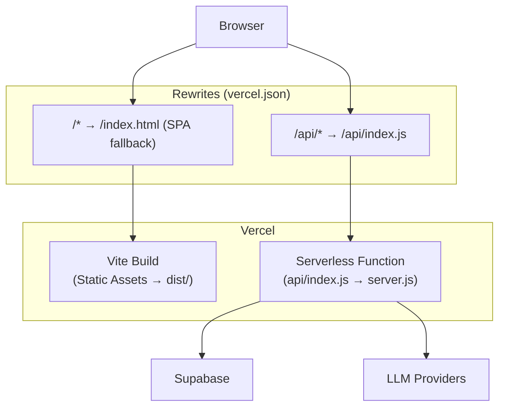

### `vercel.json`

```json
{
  "rewrites": [
    { "source": "/api/(.*)", "destination": "/api/index.js" },
    { "source": "/(.*)", "destination": "/index.html" }
  ]
}
```

### Local Development

```bash
npm run dev          # Runs BOTH Vite (port 5173) + Express (port 3001) concurrently
npm run dev:frontend # Vite dev server only
npm run dev:server   # Express server only
npm run build        # Production build
npm run preview      # Preview production build
```

### Dev vs Production Server Behavior

| Behavior | Dev | Production |
|---|---|---|
| `DEV_AUTH_BYPASS` | Can be `true` — skips JWT verification | **Always disabled** even if env var is set |
| API Base URL | `http://localhost:3001` | `''` (same origin via Vercel rewrites) |
| CORS | `*` or custom | Configured via `CORS_ORIGIN` env var |
| Server binding | `http.createServer(app).listen(PORT)` | **Not called** — Vercel manages lifecycle |

---

## 23. Environment Variables

### Required Variables

| Variable | Where Used | Description |
|---|---|---|
| `VITE_SUPABASE_URL` | Frontend + Backend | Supabase project URL |
| `VITE_SUPABASE_ANON_KEY` | Frontend | Supabase anonymous key (client-side) |
| `SUPABASE_SERVICE_ROLE_KEY` | Backend only | Supabase admin key (server-side only!) |
| `ENCRYPTION_SECRET` | Backend only | AES-256-GCM encryption master secret |

### Optional Variables

| Variable | Default | Description |
|---|---|---|
| `VITE_NVIDIA_API_KEY` | `''` | Default NVIDIA API key fallback |
| `DEV_AUTH_BYPASS` | `false` | Skip JWT auth in local dev |
| `FALLBACK_KEYS` | `''` | Comma-separated backup LLM API keys |
| `CORS_ORIGIN` | `'*'` | Allowed CORS origins |
| `PORT` | `3001` | Express server port |
| `NODE_ENV` | — | `'production'` disables DEV_AUTH_BYPASS |
| `VITE_API_URL` | — | Override API base URL |

### `.env.example`

```bash
VITE_SUPABASE_URL=your_supabase_project_url
VITE_SUPABASE_ANON_KEY=your_supabase_anon_key
SUPABASE_SERVICE_ROLE_KEY=your_supabase_service_role_key
ENCRYPTION_SECRET=your_32_byte_hex_encryption_secret_here
VITE_NVIDIA_API_KEY=your_nvidia_api_key_here
DEV_AUTH_BYPASS=true
FALLBACK_KEYS=your_key_here
```

---

## 24. Design Patterns Used

| Pattern | Where | Why |
|---|---|---|
| **Adapter** | `AuthAdapter`, `DatabaseAdapter` | Decouple from vendors (Supabase, Firebase, custom API) |
| **Factory Method** | `BlockFactory`, `CanvasElementFactory` | Extensible object creation without modifying callers |
| **Registry** | `BlockRegistry`, `NodeComponentRegistry`, `ExecutionStrategyManager` | Open/Closed Principle — add types without editing existing code |
| **Strategy** | `IExecutionStrategy`, `GroqStrategy`, `LocalStrategy` | Swap LLM execution behavior at runtime |
| **Decorator** | `AuthenticatedApiProxy` wraps `FetchHttpClient` | Add auth headers transparently without modifying HTTP client |
| **Command** | `ICommand`, `CommandHistory` | Undo/Redo infrastructure for canvas operations |
| **Observer** | `onAuthStateChange`, `useWorkflowStore.subscribe` | React to auth state changes, store updates |
| **Slice** | `blockSlice`, `canvasSlice`, `groupSlice`, etc. | Modular state composition in Zustand |
| **Singleton** | `supabase`, `apiProxy`, `httpClient` | Single instance of shared services |
| **Progressive Disclosure** | `revealedPhases`, phase overlays | Gradual UI reveal during workflow execution |
| **Neural Bridge** | `neuralContext` parameter in LLM calls | Previous phase outputs feed into next phase as context |

---

## 25. Known Bug Tracker References

The codebase contains references to tracked bugs. Here are the documented ones:

| Bug ID | Location | Description |
|---|---|---|
| **BUG-003** | `useWorkflowExecution.tsx` | Abort controller cleanup and timeout handling for stuck LLM calls |
| **BUG-008** | `useProjectCollaborators.ts` | Replaced hardcoded static dummy collaborator list in ShareModal |
| **BUG-017** | `blockSlice.ts` | `selectedBlockIds` stored as `string[]` (not `Set`) for Zustand persist JSON compatibility |
| **BUG-019** | `groupSlice.ts` | Clear deleted group member IDs from selection state on group deletion |

---

## 26. Developer Onboarding Checklist

### Setting Up Locally

```bash
# 1. Clone the repository
git clone <repo-url>
cd floatit-frontend

# 2. Install dependencies
npm install

# 3. Create environment file
cp .env.example .env
# Fill in your Supabase credentials and other values

# 4. Start development
npm run dev
# This starts both Vite (port 5173) and Express (port 3001)
```

### Key Things to Understand First

1. **Read `src/data/schema.ts`** — This is the heart of the domain model (phases, categories, tools, edges)
2. **Read `src/lib/store.ts`** — Understand the workflow execution state machine
3. **Read `src/lib/builderStore.ts`** — Understand how slices compose the canvas state
4. **Read `server.js` lines 150-189** — Understand the Universal Gateway protocol
5. **Read `src/hooks/useWorkflowExecution.tsx`** — Understand pipeline orchestration

### Mental Model

```
User creates blocks on canvas
  → Groups blocks together
    → Runs the workflow
      → Each group's agents call LLMs in parallel (batch of 2)
        → Synthesis node summarizes group outputs
          → Output becomes context for next group
            → Final output screen shows all results
              → 🎉 Confetti
```

### Common Tasks

| Task | What to Edit |
|---|---|
| Add a new LLM provider | `server.js` → `determineProvider()` function |
| Add a new page | `src/pages/` + update `App.jsx` routing logic |
| Add a new block type | `src/lib/blocks/` + `src/types/engine.ts` |
| Change auth backend | `src/main.jsx` — swap adapter instance |
| Change database backend | `src/lib/database/index.ts` — swap adapter instance |
| Add a new store slice | `src/lib/stores/` + compose into `builderStore.ts` |
| Modify LLM system prompt | `server.js` → search for `systemPrompt` |
| Add a new UX tool to schema | `src/data/schema.ts` → `TOOL_REGISTRY` + `UX_CATEGORIES` |

---

## 27. Future Roadmap Considerations

These are architectural decisions left open for future developers:

### Authentication Migration

The `LocalServerAuthAdapter` is a **fully scaffolded placeholder** ready for implementation. When migrating off Supabase:

1. Implement REST endpoints: `/auth/register`, `/auth/login`, `/auth/logout`, `/auth/profile/:userId`
2. The adapter already handles localStorage token management and listener notification

### Real-Time Collaboration

The current collaboration system uses Supabase tables. For true real-time multi-user editing:

- Consider Supabase Realtime channels for presence awareness
- Implement operational transforms (OT) or CRDTs for concurrent canvas edits
- The `CanvasComment` system is already designed for multi-user annotation

### Command History Integration

The `CommandHistory` class and `ICommand` interface are built but not yet wired into all canvas operations. To enable full undo/redo:

1. Create command classes for each mutation (e.g., `AddBlockCommand`, `MoveBlockCommand`)
2. Route canvas operations through `CommandHistory.execute()`
3. Bind Ctrl+Z / Ctrl+Y to `CommandHistory.undo()` / `CommandHistory.redo()`

### Plugin Architecture

The `BlockRegistry` and `NodeComponentRegistry` are designed to support a plugin system where third-party block types can be registered at runtime.

### Offline Support

The Zustand persist middleware already saves to `localStorage`. To add offline capability:

- Queue server-sync operations when offline
- Replay queue on reconnection
- Use `navigator.onLine` for connectivity detection

---

*This documentation was written to ensure any future developer can understand not just **what** the code does, but **why** architectural decisions were made. When in doubt, trace through the adapter interfaces — they reveal the intended flexibility of the system.*

---

**End of Documentation**
